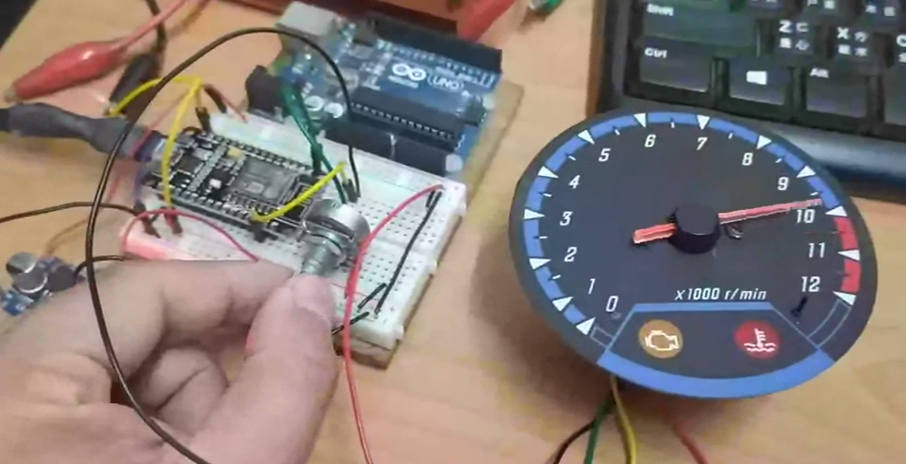

# RPM_GENERATOR
Nodemcu V2 RPM Generator
簡易型 Nodemcu V2 RPM 訊號產生器

<h2>接腳</h2>
<ul>
  <li>A0：可變電阻 B10K 中間腳</li>
  <li>D1：PWM 輸出
</ul>

 
<h2>注意事項</h2>
<ul>
  <li>1. 可變電阻的 Vcc 需用 5V</li>
  <li>2. 一般轉速表的正電是 12V</li>
  <li>3. 有些轉速表如 FZR 是負綠觸發，輸出建議可以改成交流輸出，或調整電位差</li>
</ul>
 
